# Design Patterns Analysis - Flight Reservation System

### Team 29
* Shubham Goel (2023101076)
* Swam Singla (2023101134)
* Saksham Chitkara (2023101021)
* Shreyas Mehta (2023101059)
* Srinivas Chitta (2025900001)

## Table of Contents
1. [Observer Pattern](#observer-pattern)
2. [Factory Pattern](#factory-pattern)
3. [Adapter Pattern](#adapter-pattern)
4. [Builder Pattern](#builder-pattern)
5. [Strategy Pattern](#strategy-pattern)
6. [Chain of Responsibility Pattern](#chain-of-responsibility-pattern)

---

## Observer Pattern

### Overview
The Observer Pattern defines a one-to-many dependency between objects so that when one object changes state, all its dependents are notified automatically.

### Current State Analysis
**Challenge**: The system lacks notification mechanisms for important events:
- Flight booking confirmation
- Capacity changes
- Payment processing status
- Schedule updates

### Application and Reasoning

**Why Apply This Pattern?**
- Multiple entities need to react to booking events (Customer, ScheduledFlight, PaymentProcessor)
- Decouples event producers from consumers
- Enables flexible, real-time notifications
- Supports logging, auditing, and analytics without modifying core classes

**Benefits:**
- ✅ Loose coupling between components
- ✅ Dynamic subscription/unsubscription at runtime
- ✅ Supports multiple observers
- ✅ Enables email/SMS notifications, logging, audit trails
- ✅ Easy to extend with new notification types

**Drawbacks:**
- ❌ Performance overhead with many observers
- ❌ Notification order is unpredictable
- ❌ Memory overhead for storing observer references
- ❌ Potential for memory leaks if observers not unsubscribed

### Class Diagram
**Before Pattern**: 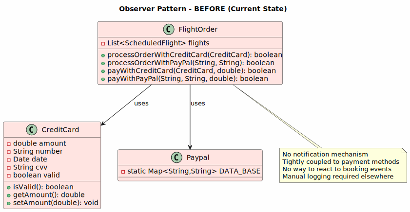  
**After Pattern**: 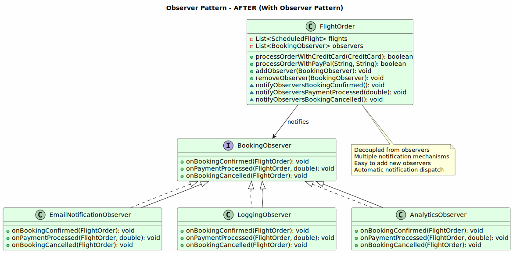

### Implementation Example

```java
// Observer Interface
public interface BookingObserver {
    void onBookingConfirmed(FlightOrder order);
    void onPaymentProcessed(FlightOrder order, double amount);
    void onBookingCancelled(FlightOrder order);
}

// Concrete Observer - Email Notification
public class EmailNotificationObserver implements BookingObserver {
    @Override
    public void onBookingConfirmed(FlightOrder order) {
        String email = order.getCustomer().getEmail();
        System.out.println("Sending confirmation email to: " + email);
        // Send email logic
    }
    
    @Override
    public void onPaymentProcessed(FlightOrder order, double amount) {
        String email = order.getCustomer().getEmail();
        System.out.println("Sending payment receipt to: " + email + 
                         " for amount: $" + amount);
    }
    
    @Override
    public void onBookingCancelled(FlightOrder order) {
        System.out.println("Sending cancellation notice to: " + 
                         order.getCustomer().getEmail());
    }
}

// Concrete Observer - Logging
public class LoggingObserver implements BookingObserver {
    @Override
    public void onBookingConfirmed(FlightOrder order) {
        System.out.println("[LOG] Booking confirmed: " + order.getId());
    }
    
    @Override
    public void onPaymentProcessed(FlightOrder order, double amount) {
        System.out.println("[LOG] Payment processed: $" + amount + 
                         " for order " + order.getId());
    }
    
    @Override
    public void onBookingCancelled(FlightOrder order) {
        System.out.println("[LOG] Booking cancelled: " + order.getId());
    }
}

// Subject - Modified FlightOrder
public class FlightOrder extends Order {
    private final List<ScheduledFlight> flights;
    private List<BookingObserver> observers = new ArrayList<>();
    
    // ... existing code ...
    
    public void addObserver(BookingObserver observer) {
        observers.add(observer);
    }
    
    public void removeObserver(BookingObserver observer) {
        observers.remove(observer);
    }
    
    private void notifyObserversBookingConfirmed() {
        observers.forEach(observer -> observer.onBookingConfirmed(this));
    }
    
    private void notifyObserversPaymentProcessed(double amount) {
        observers.forEach(observer -> observer.onPaymentProcessed(this, amount));
    }
    
    private void notifyObserversBookingCancelled() {
        observers.forEach(observer -> observer.onBookingCancelled(this));
    }
    
    public boolean processOrderWithCreditCard(CreditCard creditCard) 
            throws IllegalStateException {
        if (isClosed()) {
            return true;
        }
        if (!cardIsPresentAndValid(creditCard)) {
            throw new IllegalStateException("Payment information is invalid.");
        }
        boolean isPaid = payWithCreditCard(creditCard, this.getPrice());
        if (isPaid) {
            this.setClosed();
            notifyObserversPaymentProcessed(this.getPrice());
            notifyObserversBookingConfirmed();
        }
        return isPaid;
    }
}

// Usage
public class FlightOrderClient {
    public static void main(String[] args) {
        FlightOrder order = new FlightOrder(flights);
        
        // Subscribe observers
        order.addObserver(new EmailNotificationObserver());
        order.addObserver(new LoggingObserver());
        
        // Process payment - will automatically notify all observers
        order.processOrderWithCreditCard(creditCard);
    }
}
```

---

## Factory Pattern

### Overview
The Factory Pattern provides an interface for creating objects without specifying their exact classes, promoting loose coupling and flexibility.

### Current State Analysis
**Challenge**: Aircraft creation uses switch statements with type checking in multiple places:
```java
// Current approach scattered across codebase
if (aircraft instanceof PassengerPlane) {
    // handle PassengerPlane
} else if (aircraft instanceof Helicopter) {
    // handle Helicopter
}
```

### Application and Reasoning

**Why Apply This Pattern?**
- Centralized aircraft creation logic
- Easy to add new aircraft types (PassengerPlane, Helicopter, PassengerDrone)
- Reduces duplication of type checking logic
- Simplifies capacity and crew management
- Enables polymorphic handling of different aircraft

**Benefits:**
- ✅ Encapsulates object creation logic
- ✅ Eliminates switch/if-else statements for type checking
- ✅ Easy to add new aircraft types
- ✅ Single responsibility for aircraft creation
- ✅ Improves code maintainability
- ✅ Supports polymorphism

**Drawbacks:**
- ❌ Adds more classes to the codebase
- ❌ Small overhead for simple object creation
- ❌ May be overkill for simple systems
- ❌ Requires refactoring existing code

### Class Diagram
**Before Pattern**: 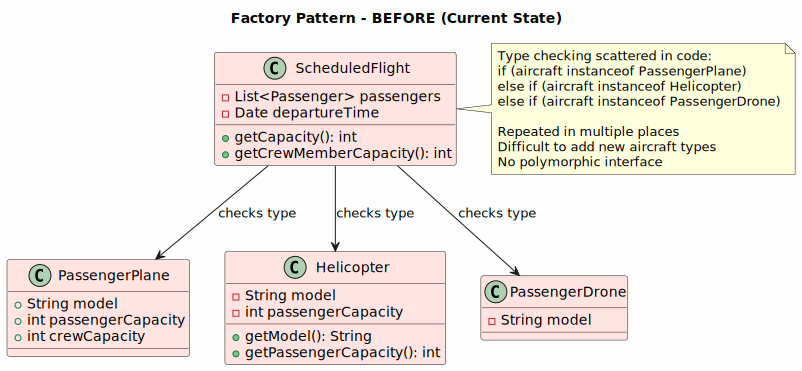  
**After Pattern**: 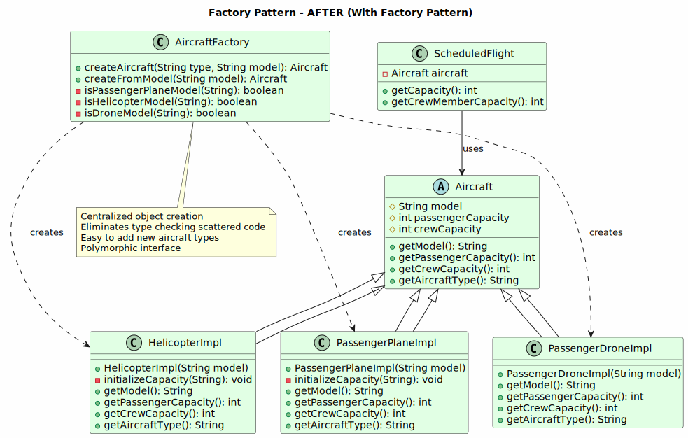

### Implementation Example

```java
// Aircraft Base Interface/Class
public abstract class Aircraft {
    protected String model;
    protected int passengerCapacity;
    protected int crewCapacity;
    
    public abstract String getModel();
    public abstract int getPassengerCapacity();
    public abstract int getCrewCapacity();
    public abstract String getAircraftType();
}

// Concrete Aircraft Classes (refactored)
public class PassengerPlaneImpl extends Aircraft {
    public PassengerPlaneImpl(String model) {
        this.model = model;
        initializeCapacity(model);
    }
    
    private void initializeCapacity(String model) {
        switch (model) {
            case "A380":
                this.passengerCapacity = 500;
                this.crewCapacity = 42;
                break;
            case "A350":
                this.passengerCapacity = 320;
                this.crewCapacity = 40;
                break;
            case "Embraer 190":
                this.passengerCapacity = 25;
                this.crewCapacity = 5;
                break;
            case "Antonov AN2":
                this.passengerCapacity = 15;
                this.crewCapacity = 3;
                break;
            default:
                throw new IllegalArgumentException("Model not recognized: " + model);
        }
    }
    
    @Override
    public String getModel() { return model; }
    
    @Override
    public int getPassengerCapacity() { return passengerCapacity; }
    
    @Override
    public int getCrewCapacity() { return crewCapacity; }
    
    @Override
    public String getAircraftType() { return "PassengerPlane"; }
}

public class HelicopterImpl extends Aircraft {
    public HelicopterImpl(String model) {
        this.model = model;
        initializeCapacity(model);
    }
    
    private void initializeCapacity(String model) {
        switch (model) {
            case "H1":
                this.passengerCapacity = 4;
                this.crewCapacity = 1;
                break;
            case "H2":
                this.passengerCapacity = 6;
                this.crewCapacity = 1;
                break;
            default:
                throw new IllegalArgumentException("Model not recognized: " + model);
        }
    }
    
    @Override
    public String getModel() { return model; }
    
    @Override
    public int getPassengerCapacity() { return passengerCapacity; }
    
    @Override
    public int getCrewCapacity() { return crewCapacity; }
    
    @Override
    public String getAircraftType() { return "Helicopter"; }
}

public class PassengerDroneImpl extends Aircraft {
    public PassengerDroneImpl(String model) {
        if (model.equals("HypaHype")) {
            this.model = model;
            this.passengerCapacity = 4;
            this.crewCapacity = 0;
        } else {
            throw new IllegalArgumentException("Model not recognized: " + model);
        }
    }
    
    @Override
    public String getModel() { return model; }
    
    @Override
    public int getPassengerCapacity() { return passengerCapacity; }
    
    @Override
    public int getCrewCapacity() { return crewCapacity; }
    
    @Override
    public String getAircraftType() { return "PassengerDrone"; }
}

// Aircraft Factory
public class AircraftFactory {
    
    public static Aircraft createAircraft(String type, String model) 
            throws IllegalArgumentException {
        switch (type.toLowerCase()) {
            case "passengerplane":
                return new PassengerPlaneImpl(model);
            case "helicopter":
                return new HelicopterImpl(model);
            case "passengerdrone":
                return new PassengerDroneImpl(model);
            default:
                throw new IllegalArgumentException("Unknown aircraft type: " + type);
        }
    }
    
    // Convenience method for direct model-based creation
    public static Aircraft createFromModel(String model) {
        if (isPassengerPlaneModel(model)) {
            return new PassengerPlaneImpl(model);
        } else if (isHelicopterModel(model)) {
            return new HelicopterImpl(model);
        } else if (isDroneModel(model)) {
            return new PassengerDroneImpl(model);
        } else {
            throw new IllegalArgumentException("Unknown model: " + model);
        }
    }
    
    private static boolean isPassengerPlaneModel(String model) {
        return model.matches("A380|A350|Embraer 190|Antonov AN2");
    }
    
    private static boolean isHelicopterModel(String model) {
        return model.matches("H1|H2");
    }
    
    private static boolean isDroneModel(String model) {
        return model.equals("HypaHype");
    }
}

// Usage in ScheduledFlight (refactored)
public class ScheduledFlight extends Flight {
    // ... existing code ...
    
    public int getCapacity() throws NoSuchFieldException {
        if (this.aircraft instanceof Aircraft) {
            return ((Aircraft) this.aircraft).getPassengerCapacity();
        }
        throw new NoSuchFieldException("Aircraft information unavailable");
    }
    
    public int getCrewMemberCapacity() throws NoSuchFieldException {
        if (this.aircraft instanceof Aircraft) {
            return ((Aircraft) this.aircraft).getCrewCapacity();
        }
        throw new NoSuchFieldException("Aircraft information unavailable");
    }
}

// Client Usage
public class RunnerWithFactory {
    public static void main(String[] args) {
        // Create aircraft using factory
        Aircraft plane = AircraftFactory.createAircraft("passengerplane", "A380");
        Aircraft helicopter = AircraftFactory.createAircraft("helicopter", "H1");
        Aircraft drone = AircraftFactory.createFromModel("HypaHype");
        
        // Create flights with factory-created aircraft
        Flight flight1 = new Flight(1, berlinAirport, frankfurtAirport, plane);
        Flight flight2 = new Flight(2, jfkAirport, berlinAirport, helicopter);
    }
}
```

---

## Adapter Pattern

### Overview
The Adapter Pattern converts the interface of a class into another interface that clients expect, allowing incompatible interfaces to work together (also called Wrapper).

### Current State Analysis
**Challenge**: Payment methods (CreditCard and PayPal) have different interfaces:
```java
// CreditCard has: isValid(), getAmount(), setAmount()
// PayPal has: static DATA_BASE map with different structure

// Usage is inconsistent and scattered in FlightOrder
boolean isPaid = payWithCreditCard(creditCard, amount);  // direct method
boolean isPaid = payWithPayPal(email, password, amount); // different signature
```

### Application and Reasoning

**Why Apply This Pattern?**
- Unifies different payment method interfaces
- Allows new payment methods to be added without modifying core order logic
- Encapsulates payment processing details
- Enables polymorphic treatment of all payment methods
- Reduces code duplication in order processing

**Benefits:**
- ✅ Makes incompatible interfaces compatible
- ✅ Reduces code duplication
- ✅ Single unified payment interface
- ✅ Easy to add new payment methods
- ✅ Decouples payment logic from order logic
- ✅ Better testability and flexibility

**Drawbacks:**
- ❌ Adds additional layer of abstraction
- ❌ Slight performance overhead
- ❌ May overcomplicate simple scenarios
- ❌ Requires understanding of adapter hierarchy

### Class Diagram
**Before Pattern**: 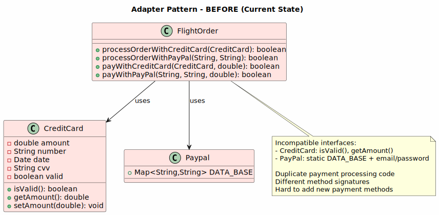
**After Pattern**: 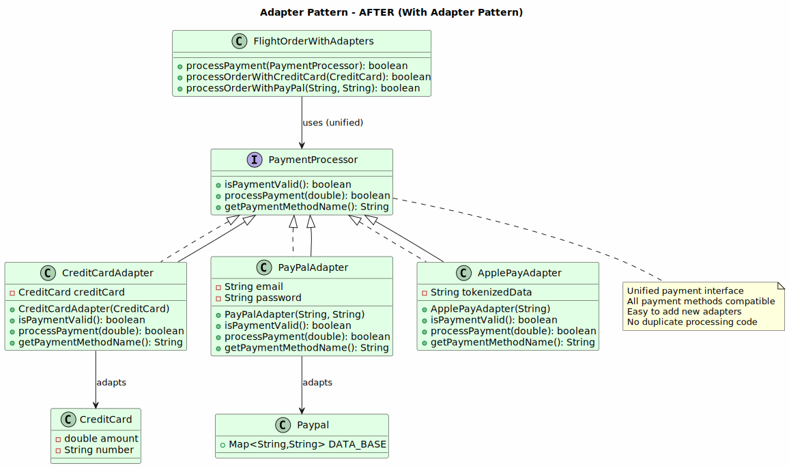

### Implementation Example

```java
// Common Payment Interface (Target Interface)
public interface PaymentProcessor {
    boolean isPaymentValid();
    boolean processPayment(double amount) throws IllegalStateException;
    String getPaymentMethodName();
}

// Adapter for Credit Card
public class CreditCardAdapter implements PaymentProcessor {
    private final CreditCard creditCard;
    
    public CreditCardAdapter(CreditCard creditCard) {
        this.creditCard = creditCard;
    }
    
    @Override
    public boolean isPaymentValid() {
        return creditCard != null && creditCard.isValid();
    }
    
    @Override
    public boolean processPayment(double amount) throws IllegalStateException {
        if (!isPaymentValid()) {
            throw new IllegalStateException("Invalid credit card");
        }
        
        double remainingAmount = creditCard.getAmount() - amount;
        if (remainingAmount < 0) {
            System.out.printf("Card limit reached - Balance: %f%n", remainingAmount);
            throw new IllegalStateException("Insufficient card balance");
        }
        
        System.out.println("Processing payment of $" + amount + 
                         " via Credit Card");
        creditCard.setAmount(remainingAmount);
        return true;
    }
    
    @Override
    public String getPaymentMethodName() {
        return "Credit Card";
    }
}

// Adapter for PayPal
public class PayPalAdapter implements PaymentProcessor {
    private final String email;
    private final String password;
    
    public PayPalAdapter(String email, String password) {
        this.email = email;
        this.password = password;
    }
    
    @Override
    public boolean isPaymentValid() {
        return email != null && 
               password != null && 
               email.equals(Paypal.DATA_BASE.get(password));
    }
    
    @Override
    public boolean processPayment(double amount) throws IllegalStateException {
        if (!isPaymentValid()) {
            throw new IllegalStateException("Invalid PayPal credentials");
        }
        
        System.out.println("Processing payment of $" + amount + 
                         " via PayPal");
        // PayPal processing logic
        return true;
    }
    
    @Override
    public String getPaymentMethodName() {
        return "PayPal";
    }
}

// Adapter for Apple Pay/Future payment methods
public class ApplePayAdapter implements PaymentProcessor {
    private final String tokenizedData;
    
    public ApplePayAdapter(String tokenizedData) {
        this.tokenizedData = tokenizedData;
    }
    
    @Override
    public boolean isPaymentValid() {
        return tokenizedData != null && tokenizedData.length() > 0;
    }
    
    @Override
    public boolean processPayment(double amount) throws IllegalStateException {
        if (!isPaymentValid()) {
            throw new IllegalStateException("Invalid Apple Pay token");
        }
        
        System.out.println("Processing payment of $" + amount + 
                         " via Apple Pay");
        return true;
    }
    
    @Override
    public String getPaymentMethodName() {
        return "Apple Pay";
    }
}

// Refactored FlightOrder using Adapters
public class FlightOrderWithAdapters extends Order {
    private final List<ScheduledFlight> flights;
    static List<String> noFlyList = Arrays.asList("Peter", "Johannes");
    
    public FlightOrderWithAdapters(List<ScheduledFlight> flights) {
        this.flights = flights;
    }
    
    public List<ScheduledFlight> getScheduledFlights() {
        return flights;
    }
    
    // Unified payment processing using adapters
    public boolean processPayment(PaymentProcessor processor) 
            throws IllegalStateException {
        if (isClosed()) {
            return true; // Already processed
        }
        
        if (!processor.isPaymentValid()) {
            throw new IllegalStateException(
                "Payment validation failed for " + 
                processor.getPaymentMethodName());
        }
        
        boolean isPaid = processor.processPayment(this.getPrice());
        if (isPaid) {
            this.setClosed();
            System.out.println("Order " + this.getId() + 
                             " successfully paid using " + 
                             processor.getPaymentMethodName());
        }
        return isPaid;
    }
    
    // Legacy methods - now use adapters internally
    public boolean processOrderWithCreditCard(CreditCard creditCard) 
            throws IllegalStateException {
        PaymentProcessor processor = new CreditCardAdapter(creditCard);
        return processPayment(processor);
    }
    
    public boolean processOrderWithPayPal(String email, String password) 
            throws IllegalStateException {
        PaymentProcessor processor = new PayPalAdapter(email, password);
        return processPayment(processor);
    }
}

// Client Usage
public class PaymentProcessingClient {
    public static void main(String[] args) {
        FlightOrderWithAdapters order = new FlightOrderWithAdapters(flights);
        
        // Process with different payment methods using same interface
        CreditCard card = new CreditCard("4532123456789", 
                                        new Date(), "123");
        PaymentProcessor cardProcessor = new CreditCardAdapter(card);
        order.processPayment(cardProcessor);
        
        // Add new payment method without modifying FlightOrder
        PaymentProcessor applePayProcessor = 
            new ApplePayAdapter("tokenizedApplePayData");
        order.processPayment(applePayProcessor);
    }
}
```

---

## Builder Pattern

### Overview
The Builder Pattern constructs complex objects step by step, separating the construction process from the object's representation, resulting in more readable and flexible code.

### Current State Analysis
**Challenge**: Creating a FlightOrder requires multiple sequential steps with error-prone parameter passing:
```java
// Current approach - difficult to manage
FlightOrder order = new FlightOrder(flights);
order.setCustomer(customer);
order.setPrice(price);
order.setPassengers(passengers);
// Price must be calculated separately
// Sequence is important but not enforced
```

### Application and Reasoning

**Why Apply This Pattern?**
- Complex multi-step order creation process
- Many optional and required parameters
- Improves code readability and maintainability
- Validates object state before creation
- Allows different construction strategies
- Makes object immutable after creation

**Benefits:**
- ✅ Makes complex object construction more readable
- ✅ Separates construction logic from object representation
- ✅ Supports optional parameters elegantly
- ✅ Enforces object consistency before creation
- ✅ Provides fluent interface
- ✅ Easier to understand parameter values

**Drawbacks:**
- ❌ Creates additional builder classes
- ❌ Verbose for simple objects
- ❌ Extra memory overhead
- ❌ More code to maintain

### Class Diagram
**Before Pattern**:

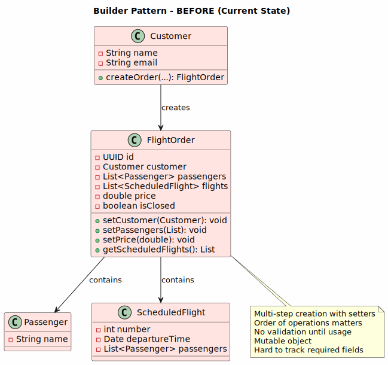 

**After Pattern**: 
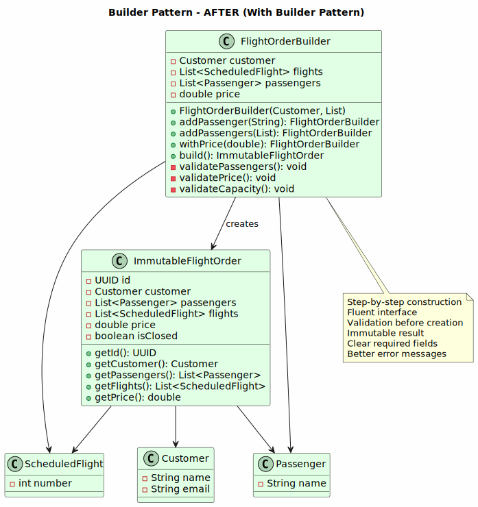

### Implementation Example

```java
// Immutable FlightOrder after creation
public class ImmutableFlightOrder {
    private final UUID id;
    private final Customer customer;
    private final List<Passenger> passengers;
    private final List<ScheduledFlight> flights;
    private final double price;
    private final boolean isClosed;
    
    private ImmutableFlightOrder(FlightOrderBuilder builder) {
        this.id = UUID.randomUUID();
        this.customer = builder.customer;
        this.passengers = new ArrayList<>(builder.passengers);
        this.flights = new ArrayList<>(builder.flights);
        this.price = builder.price;
        this.isClosed = false;
    }
    
    // Static builder class
    public static class FlightOrderBuilder {
        private final Customer customer;
        private final List<ScheduledFlight> flights;
        private final List<Passenger> passengers;
        private double price = 0.0;
        
        public FlightOrderBuilder(Customer customer, 
                                 List<ScheduledFlight> flights) {
            if (customer == null || flights == null || flights.isEmpty()) {
                throw new IllegalArgumentException(
                    "Customer and flights are required");
            }
            this.customer = customer;
            this.flights = flights;
            this.passengers = new ArrayList<>();
        }
        
        // Add passenger by name
        public FlightOrderBuilder addPassenger(String passengerName) {
            if (passengerName == null || passengerName.isEmpty()) {
                throw new IllegalArgumentException(
                    "Passenger name cannot be empty");
            }
            this.passengers.add(new Passenger(passengerName));
            return this;
        }
        
        // Add multiple passengers
        public FlightOrderBuilder addPassengers(List<String> names) {
            if (names == null || names.isEmpty()) {
                throw new IllegalArgumentException(
                    "At least one passenger is required");
            }
            names.forEach(this::addPassenger);
            return this;
        }
        
        // Set price
        public FlightOrderBuilder withPrice(double price) {
            if (price <= 0) {
                throw new IllegalArgumentException(
                    "Price must be greater than 0");
            }
            this.price = price;
            return this;
        }
        
        // Validate and build
        public ImmutableFlightOrder build() {
            if (passengers.isEmpty()) {
                throw new IllegalStateException(
                    "At least one passenger is required");
            }
            
            if (price == 0.0) {
                throw new IllegalStateException(
                    "Price must be set before building order");
            }
            
            // Validate customers on no-fly list
            if (FlightOrder.getNoFlyList().contains(customer.getName())) {
                throw new IllegalStateException(
                    "Customer is on the no-fly list");
            }
            
            // Validate passengers on no-fly list
            String noFlyPassenger = passengers.stream()
                .map(Passenger::getName)
                .filter(name -> FlightOrder.getNoFlyList().contains(name))
                .findFirst()
                .orElse(null);
            
            if (noFlyPassenger != null) {
                throw new IllegalStateException(
                    "Passenger " + noFlyPassenger + 
                    " is on the no-fly list");
            }
            
            // Validate capacity
            try {
                for (ScheduledFlight flight : flights) {
                    if (flight.getAvailableCapacity() < passengers.size()) {
                        throw new IllegalStateException(
                            "Insufficient capacity on flight " + 
                            flight.getNumber());
                    }
                }
            } catch (NoSuchFieldException e) {
                throw new IllegalStateException(
                    "Cannot determine flight capacity");
            }
            
            return new ImmutableFlightOrder(this);
        }
    }
    
    // Getters
    public UUID getId() { return id; }
    public Customer getCustomer() { return customer; }
    public List<Passenger> getPassengers() { return List.copyOf(passengers); }
    public List<ScheduledFlight> getFlights() { return List.copyOf(flights); }
    public double getPrice() { return price; }
    public boolean isClosed() { return isClosed; }
}

// Usage
public class FlightOrderBuilderClient {
    public static void main(String[] args) throws NoSuchFieldException {
        Customer customer = new Customer("Max Mustermann", "max@example.com");
        List<ScheduledFlight> flights = new ArrayList<>();
        ScheduledFlight flight = new ScheduledFlight(1, berlin, frankfurt, 
                                                     plane, new Date());
        flights.add(flight);
        
        try {
            // Build order step by step
            ImmutableFlightOrder order = 
                new ImmutableFlightOrder.FlightOrderBuilder(customer, flights)
                    .addPassenger("Alice Smith")
                    .addPassenger("Bob Johnson")
                    .withPrice(500.0)
                    .build();
            
            System.out.println("Order created successfully: " + order.getId());
            System.out.println("Passengers: " + order.getPassengers().size());
            System.out.println("Total price: $" + order.getPrice());
            
        } catch (IllegalStateException e) {
            System.err.println("Failed to build order: " + e.getMessage());
        }
    }
}
```

---

## Strategy Pattern

### Overview
The Strategy Pattern defines a family of algorithms, encapsulates each one, and makes them interchangeable. It lets algorithms vary independently from the clients that use them.

### Current State Analysis
**Challenge**: Payment processing logic is tightly coupled within FlightOrder:
```java
// Different algorithms mixed in same method
public boolean processOrderWithCreditCard(CreditCard creditCard) { ... }
public boolean processOrderWithPayPal(String email, String password) { ... }
// Validation and processing logic is duplicated
```

### Application and Reasoning

**Why Apply This Pattern?**
- Different payment processing algorithms (Credit Card, PayPal)
- Runtime selection of payment strategy
- Algorithm-specific validation different for each method
- Easy to add new payment strategies (Apple Pay, Bitcoin, etc.)
- Reduces code duplication and complexity

**Benefits:**
- ✅ Isolates algorithm implementation details
- ✅ Easy to add new payment strategies
- ✅ Runtime selection of strategies
- ✅ Reduces conditional statements
- ✅ Improves testability
- ✅ Single responsibility per strategy
- ✅ Follows Open/Closed Principle

**Drawbacks:**
- ❌ More classes and complexity for simple scenarios
- ❌ Strategy selection logic needed elsewhere
- ❌ Overhead of creating strategy objects
- ❌ Potential over-engineering

### Class Diagram
**Before Pattern**: 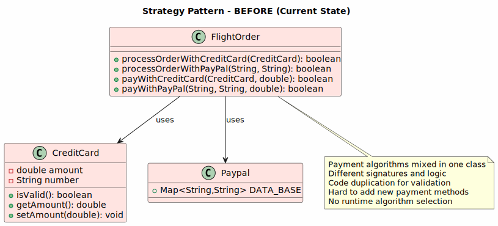 
**After Pattern**: 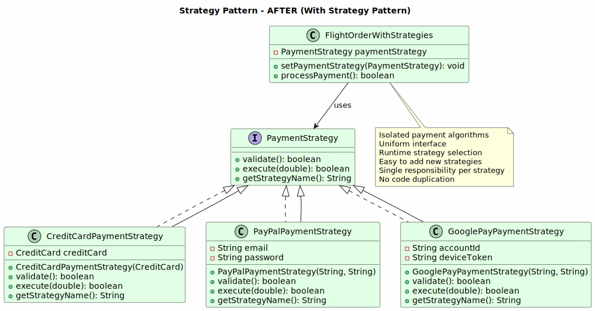

### Implementation Example

```java
// Strategy Interface
public interface PaymentStrategy {
    /**
     * Validates if the payment can be processed
     */
    boolean validate();
    
    /**
     * Executes the payment processing
     */
    boolean execute(double amount) throws IllegalStateException;
    
    /**
     * Returns the name of the payment strategy
     */
    String getStrategyName();
}

// Concrete Strategy - Credit Card Payment
public class CreditCardPaymentStrategy implements PaymentStrategy {
    private final CreditCard creditCard;
    
    public CreditCardPaymentStrategy(CreditCard creditCard) {
        this.creditCard = creditCard;
    }
    
    @Override
    public boolean validate() {
        return creditCard != null && creditCard.isValid();
    }
    
    @Override
    public boolean execute(double amount) throws IllegalStateException {
        if (!validate()) {
            throw new IllegalStateException("Invalid credit card");
        }
        
        // Strategy-specific logic
        double remainingAmount = creditCard.getAmount() - amount;
        if (remainingAmount < 0) {
            throw new IllegalStateException(
                "Insufficient card balance. Required: $" + amount + 
                ", Available: $" + creditCard.getAmount());
        }
        
        System.out.println("Charging credit card for $" + amount);
        System.out.println("Remaining balance: $" + remainingAmount);
        creditCard.setAmount(remainingAmount);
        return true;
    }
    
    @Override
    public String getStrategyName() {
        return "Credit Card Payment";
    }
}

// Concrete Strategy - PayPal Payment
public class PayPalPaymentStrategy implements PaymentStrategy {
    private final String email;
    private final String password;
    
    public PayPalPaymentStrategy(String email, String password) {
        this.email = email;
        this.password = password;
    }
    
    @Override
    public boolean validate() {
        return email != null && 
               password != null && 
               !email.isEmpty() &&
               email.equals(Paypal.DATA_BASE.get(password));
    }
    
    @Override
    public boolean execute(double amount) throws IllegalStateException {
        if (!validate()) {
            throw new IllegalStateException(
                "Invalid PayPal credentials");
        }
        
        // PayPal-specific logic
        System.out.println("Sending payment of $" + amount + 
                         " to PayPal...");
        System.out.println("PayPal account: " + email);
        // In real implementation, would call PayPal API
        return true;
    }
    
    @Override
    public String getStrategyName() {
        return "PayPal Payment";
    }
}

// Concrete Strategy - Google Pay
public class GooglePayPaymentStrategy implements PaymentStrategy {
    private final String accountId;
    private final String deviceToken;
    
    public GooglePayPaymentStrategy(String accountId, String deviceToken) {
        this.accountId = accountId;
        this.deviceToken = deviceToken;
    }
    
    @Override
    public boolean validate() {
        return accountId != null && 
               deviceToken != null && 
               !accountId.isEmpty() && 
               !deviceToken.isEmpty();
    }
    
    @Override
    public boolean execute(double amount) throws IllegalStateException {
        if (!validate()) {
            throw new IllegalStateException(
                "Invalid Google Pay credentials");
        }
        
        System.out.println("Processing Google Pay payment of $" + amount);
        System.out.println("Account ID: " + accountId);
        return true;
    }
    
    @Override
    public String getStrategyName() {
        return "Google Pay";
    }
}

// Context - FlightOrder using strategies
public class FlightOrderWithStrategies extends Order {
    private final List<ScheduledFlight> flights;
    private PaymentStrategy paymentStrategy;
    
    public FlightOrderWithStrategies(List<ScheduledFlight> flights) {
        this.flights = flights;
    }
    
    // Set payment strategy
    public void setPaymentStrategy(PaymentStrategy strategy) {
        this.paymentStrategy = strategy;
        System.out.println("Payment strategy set to: " + 
                         strategy.getStrategyName());
    }
    
    // Process payment using current strategy
    public boolean processPayment() throws IllegalStateException {
        if (isClosed()) {
            return true;
        }
        
        if (paymentStrategy == null) {
            throw new IllegalStateException(
                "No payment strategy defined");
        }
        
        System.out.println("Processing order " + this.getId() + 
                         " with: " + paymentStrategy.getStrategyName());
        boolean isPaid = paymentStrategy.execute(this.getPrice());
        
        if (isPaid) {
            this.setClosed();
            System.out.println("Order successfully paid!");
        }
        
        return isPaid;
    }
    
    public List<ScheduledFlight> getScheduledFlights() {
        return flights;
    }
}

// Usage Example
public class PaymentStrategyClient {
    public static void main(String[] args) {
        FlightOrderWithStrategies order = 
            new FlightOrderWithStrategies(flights);
        order.setPrice(500.0);
        
        try {
            // Use Credit Card Strategy
            CreditCard card = new CreditCard("4532123456789010", 
                                            new Date(), "123");
            PaymentStrategy cardStrategy = 
                new CreditCardPaymentStrategy(card);
            order.setPaymentStrategy(cardStrategy);
            order.processPayment();
            
            // OR use PayPal Strategy
            // PaymentStrategy paypalStrategy = 
            //     new PayPalPaymentStrategy("john@amazon.eu", "qwerty");
            // order.setPaymentStrategy(paypalStrategy);
            // order.processPayment();
            
            // OR use Google Pay Strategy
            // PaymentStrategy googlePayStrategy = 
            //     new GooglePayPaymentStrategy("account123", "device456");
            // order.setPaymentStrategy(googlePayStrategy);
            // order.processPayment();
            
        } catch (IllegalStateException e) {
            System.err.println("Payment failed: " + e.getMessage());
        }
    }
}
```

---

## Chain of Responsibility Pattern

### Overview
The Chain of Responsibility Pattern passes a request along a chain of handlers where each handler decides either to process the request or pass it to the next handler.

### Current State Analysis
**Challenge**: Order validation logic is scattered and mixed:
```java
// Validation logic spread across Customer and FlightOrder
private boolean isOrderValid(List<String> passengerNames, 
                            List<ScheduledFlight> flights) {
    boolean valid = true;
    valid = valid && !noFlyList.contains(customer.getName());
    valid = valid && passengerNames.stream()
        .noneMatch(passenger -> noFlyList.contains(passenger));
    valid = valid && flights.stream().allMatch(scheduledFlight -> {
        // Check capacity
    });
    return valid;
}
```

### Application and Reasoning

**Why Apply This Pattern?**
- Multiple validation handlers (no-fly list, capacity, customer history)
- Each validation is independent
- Easy to add new validators without modifying existing code
- Clear separation of validation concerns
- Enables flexible validation chains
- Improves readability

**Benefits:**
- ✅ Decouples validators from the order
- ✅ Easy to add/remove validators
- ✅ Each validator has single responsibility
- ✅ Validation order can be changed dynamically
- ✅ Improves code readability
- ✅ Follows Open/Closed Principle

**Drawbacks:**
- ❌ Adds more classes and complexity
- ❌ Harder to debug than single validation method
- ❌ Request might not be handled if chain incomplete
- ❌ Performance overhead with multiple handler checks

### Class Diagram
**Before Pattern**: 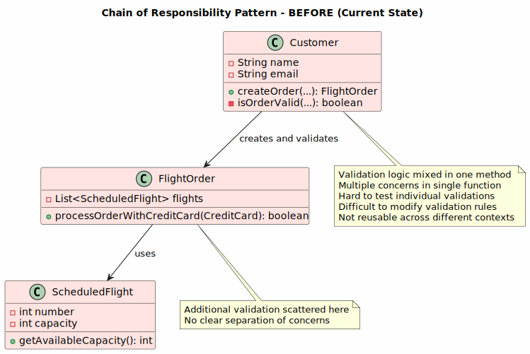  
**After Pattern**: 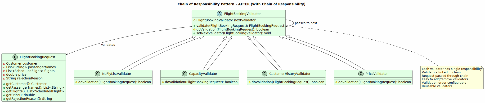

### Implementation Example

```java
// Request object
public class FlightBookingRequest {
    private final Customer customer;
    private final List<String> passengerNames;
    private final List<ScheduledFlight> flights;
    private final double price;
    private String rejectionReason;
    
    public FlightBookingRequest(Customer customer, 
                               List<String> passengerNames,
                               List<ScheduledFlight> flights, 
                               double price) {
        this.customer = customer;
        this.passengerNames = passengerNames;
        this.flights = flights;
        this.price = price;
    }
    
    // Getters
    public Customer getCustomer() { return customer; }
    public List<String> getPassengerNames() { return passengerNames; }
    public List<ScheduledFlight> getFlights() { return flights; }
    public double getPrice() { return price; }
    public String getRejectionReason() { return rejectionReason; }
    public void setRejectionReason(String reason) { 
        this.rejectionReason = reason; 
    }
}

// Handler Interface
public abstract class FlightBookingValidator {
    protected FlightBookingValidator nextValidator;
    
    public final FlightBookingRequest validate(
            FlightBookingRequest request) {
        if (doValidation(request)) {
            // Validation passed, move to next validator
            if (nextValidator != null) {
                return nextValidator.validate(request);
            }
            // All validators passed
            System.out.println("✓ All validations passed!");
            return request;
        } else {
            // Validation failed
            System.out.println("✗ Validation failed: " + 
                             request.getRejectionReason());
            return request;
        }
    }
    
    // Template method - subclasses implement specific validation
    protected abstract boolean doValidation(FlightBookingRequest request);
    
    public void setNextValidator(FlightBookingValidator next) {
        this.nextValidator = next;
    }
}

// Concrete Handler 1 - Check No-Fly List
public class NoFlyListValidator extends FlightBookingValidator {
    
    @Override
    protected boolean doValidation(FlightBookingRequest request) {
        System.out.println("Checking no-fly list...");
        
        // Check if customer is on no-fly list
        if (FlightOrder.getNoFlyList().contains(
                request.getCustomer().getName())) {
            request.setRejectionReason(
                "Customer is on the no-fly list");
            return false;
        }
        
        // Check if any passenger is on no-fly list
        for (String passengerName : request.getPassengerNames()) {
            if (FlightOrder.getNoFlyList().contains(passengerName)) {
                request.setRejectionReason(
                    "Passenger '" + passengerName + 
                    "' is on the no-fly list");
                return false;
            }
        }
        
        System.out.println("✓ No-fly list check passed");
        return true;
    }
}

// Concrete Handler 2 - Check Capacity
public class CapacityValidator extends FlightBookingValidator {
    
    @Override
    protected boolean doValidation(FlightBookingRequest request) {
        System.out.println("Checking flight capacity...");
        
        try {
            for (ScheduledFlight flight : request.getFlights()) {
                int requiredCapacity = request.getPassengerNames().size();
                int availableCapacity = flight.getAvailableCapacity();
                
                if (availableCapacity < requiredCapacity) {
                    request.setRejectionReason(
                        "Insufficient capacity on flight " + 
                        flight.getNumber() + 
                        ". Required: " + requiredCapacity + 
                        ", Available: " + availableCapacity);
                    return false;
                }
            }
        } catch (NoSuchFieldException e) {
            request.setRejectionReason(
                "Cannot determine flight capacity: " + e.getMessage());
            return false;
        }
        
        System.out.println("✓ Capacity check passed");
        return true;
    }
}

// Concrete Handler 3 - Check Customer History
public class CustomerHistoryValidator extends FlightBookingValidator {
    
    @Override
    protected boolean doValidation(FlightBookingRequest request) {
        System.out.println("Checking customer history...");
        
        Customer customer = request.getCustomer();
        
        // Check if customer has unpaid orders
        List<Order> unpaidOrders = customer.getOrders().stream()
            .filter(order -> !order.isClosed())
            .toList();
        
        if (!unpaidOrders.isEmpty()) {
            request.setRejectionReason(
                "Customer has " + unpaidOrders.size() + 
                " unpaid order(s)");
            return false;
        }
        
        System.out.println("✓ Customer history check passed");
        return true;
    }
}

// Concrete Handler 4 - Check Price Validation
public class PriceValidator extends FlightBookingValidator {
    
    @Override
    protected boolean doValidation(FlightBookingRequest request) {
        System.out.println("Validating price...");
        
        if (request.getPrice() <= 0) {
            request.setRejectionReason(
                "Invalid price: must be greater than 0");
            return false;
        }
        
        // Check if price is reasonable compared to flight distance
        // (simplified example)
        if (request.getPrice() > 100000) {
            request.setRejectionReason(
                "Price appears unreasonably high");
            return false;
        }
        
        System.out.println("✓ Price validation passed");
        return true;
    }
}

// Usage - Building the chain
public class ChainOfResponsibilityClient {
    public static void main(String[] args) {
        // Build validation chain
        FlightBookingValidator noFlyValidator = 
            new NoFlyListValidator();
        FlightBookingValidator capacityValidator = 
            new CapacityValidator();
        FlightBookingValidator historyValidator = 
            new CustomerHistoryValidator();
        FlightBookingValidator priceValidator = 
            new PriceValidator();
        
        // Link validators in chain
        noFlyValidator.setNextValidator(capacityValidator);
        capacityValidator.setNextValidator(historyValidator);
        historyValidator.setNextValidator(priceValidator);
        
        // Create booking request
        Customer customer = new Customer("Max Mustermann", 
                                        "max@example.com");
        FlightBookingRequest request = new FlightBookingRequest(
            customer,
            Arrays.asList("Alice Smith", "Bob Johnson"),
            Arrays.asList(flight),
            500.0
        );
        
        // Execute validation chain
        FlightBookingRequest result = noFlyValidator.validate(request);
        
        if (result.getRejectionReason() == null) {
            System.out.println("\n✓ Booking approved!");
            // Create the order
        } else {
            System.out.println("\n✗ Booking rejected: " + 
                             result.getRejectionReason());
        }
    }
}
```

---

## Summary Comparison Table

| Pattern | Best For | Complexity | Scalability | Ease of Use |
|---------|----------|-----------|-------------|------------|
| **Observer** | Event notifications, reactive updates | Medium | High | Medium |
| **Factory** | Object creation, type abstraction | Low | Medium | High |
| **Adapter** | Interface incompatibility, legacy code | Low | Medium | High |
| **Builder** | Complex object construction | Medium | Medium | Low |
| **Strategy** | Algorithm selection, payment methods | Medium | High | Medium |
| **Chain of Responsibility** | Sequential validation, request handling | Medium | High | Medium |

---

## Implementation Recommendations

### High Priority (Immediate Implementation)
1. **Strategy Pattern for Payments** - Already partially present; formalize it
2. **Adapter Pattern for Payment Methods** - Unify payment interfaces
3. **Factory Pattern for Aircraft** - Eliminate type checking duplication

### Medium Priority (Planned Enhancement)
4. **Chain of Responsibility for Validation** - Cleaner validation logic
5. **Observer Pattern for Notifications** - Add event capabilities

### Low Priority (Future Enhancement)
6. **Builder Pattern for Orders** - Complex object construction

### Refactoring Strategy
- Start with **Factory Pattern** (lowest risk, immediate benefits)
- Follow with **Strategy Pattern** (payment processing improvement)
- Then **Adapter Pattern** (unified payment interface)
- Implement **Chain of Responsibility** (cleaner validation)
- Add **Observer Pattern** (notification system)
- Finalize with **Builder Pattern** (complex object creation)

---

## Conclusion

The Flight Reservation System is well-suited for implementing multiple design patterns that will:
- Improve code maintainability and readability
- Reduce duplication and complexity
- Enable easier future extensions
- Separate concerns and responsibilities
- Make the codebase more testable and flexible

Each pattern addresses specific pain points in the current implementation while maintaining backward compatibility during gradual adoption.
